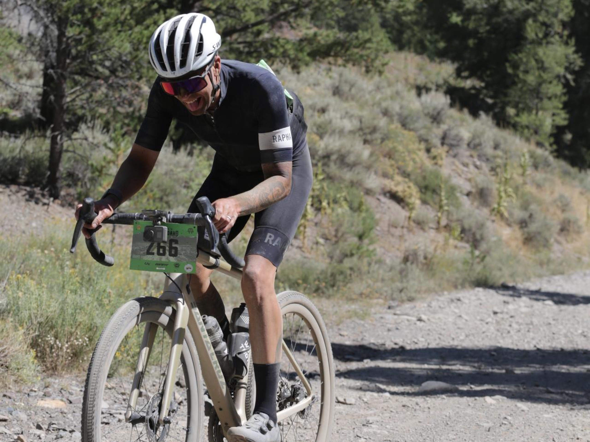
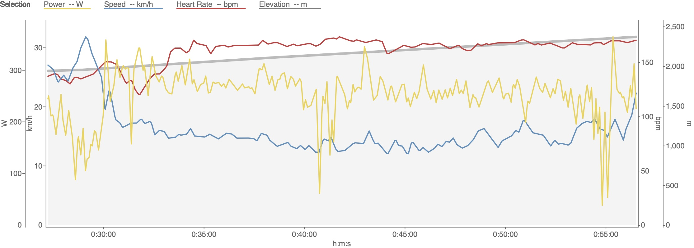
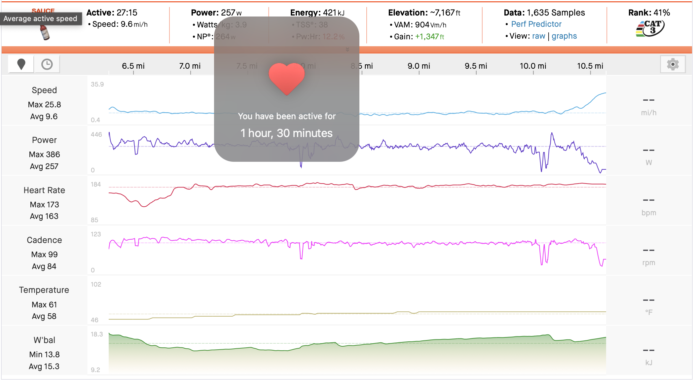
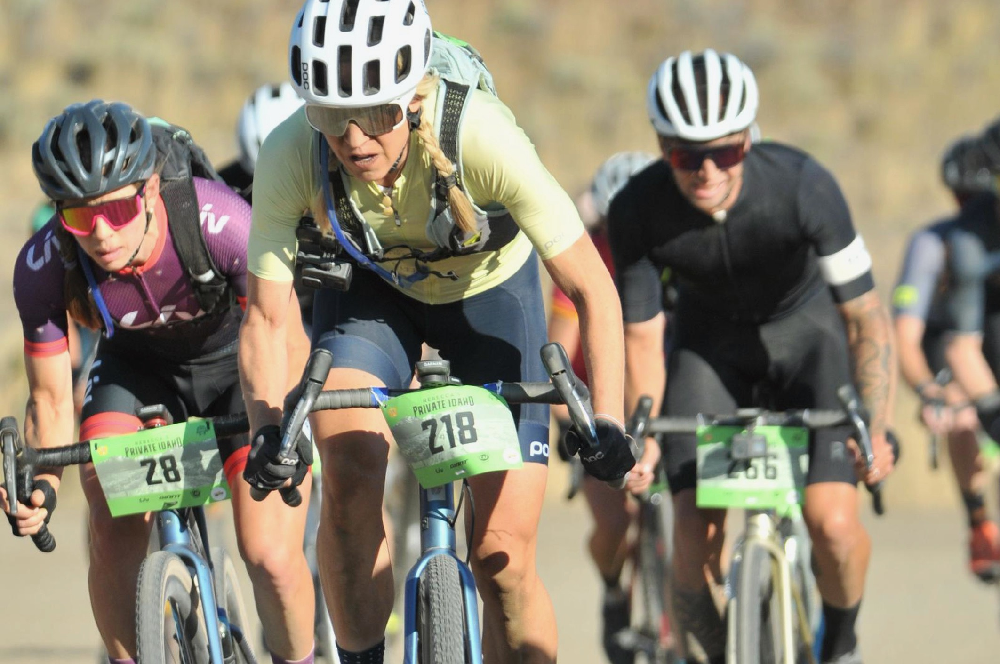

### Stage 1

### Stage 2

### Stage 3

This stage was a true sufferfest of a stage. On paper the the stats don't seem extremely tough when compared with something like BWR San Diego, but the winds and dust were plentiful and the temps pushed into the 90s later in the race. The stage starts with a longer climb and I was able to push hard and get into a good position (26min @ 268watts).

There were still to larger groups ahead that I couldn't bridge to and on the descent I decided to slow a bit to build up a group and that eventually ended up around 20+ riders. Riding with a group in this stage is huge because the winds are strong and being solo is slow and can zap motivation quickly. I stayed with this group until the aid station @ mile 46 when almost the entire group pushed on since they had hydration packs.

After the aid station, it was Brelon and I taking pulls into the wind trying to keep our speed up and find some riders ahead to group up with. We eventually linked up with Sarah and Molly and rode with them through Copper Basin. The group organically grew as we rode on and I was motivated to not lose them till the tough, rocky 5 mile double track section (Diablito) at around mile 80. It was there I was finally solo and continued to push on the remainder of the race.

I was still able to average 171 watts the final 13 miles of the race which is a huge improvement for me. My power would more drastically fade later in races last year and is something I have worked on in addition to having a solid nutrition plan for the entire race.
